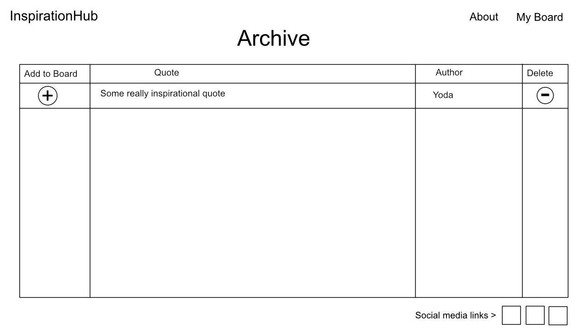

# inspiration-hub

Contributors: Chris Gantt, Jeremy Brazell, Michael Ryan, Jakob Lumpkin, Peter Staker

This is an inspirational quote board web application created using HTML, CSS, and JavaScript. Our app provides a digital whiteboard where users can add, remove and archive their favorite quotes.

## Project Management - Trello

Our team uses Trello to manage out work flow. View our project management board here:

[https://trello.com/b/LjUnpRSH/inspirationalhub](https://trello.com/b/LjUnpRSH/inspirationalhub)

## Software Requirements

[Software Requirements](requirements.md)

## Wireframe

---

---

---

## Domain Modeling

